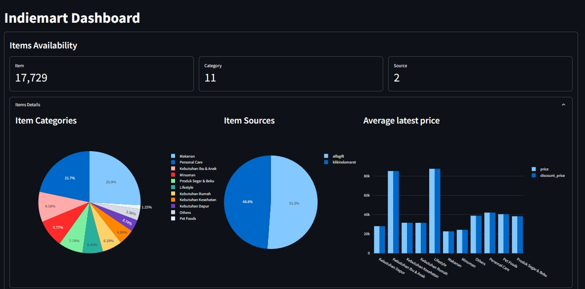
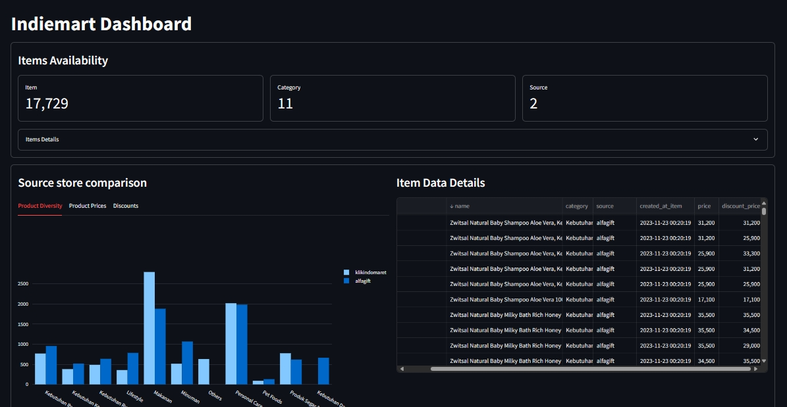

# Indiemart Dashboard

- [Description](#description)
- [Highlight](#highlight)
- [Tools](#tools)
- [How to Run This Project](#how-to-run-this-project)

## Description

This is a mini data project in attempt to accomplish [**Pelajar Data Challenge #1**](https://x.com/as_sulthoni/status/1765027539523952943?s=20). The objective is **to gain any interesting insights that can be provided to a C-Level of Indiemart**. The requirements are detailed in this [post](https://x.com/as_sulthoni/status/1765027539523952943?s=20).

Example of interesting questions (by [@BukanYahya](https://x.com/BukanYahya/status/1764307213957644590?s=20)):

- What is the lowest price product in this month?
- Is Indomie at Indomaret cheaper than at Alfamart?
- Create a statistic about the price fluctuation from this month?

## Highlight

Here is some important questions that I will present for the higher-ups besides _product description_:

- Which _source store_ has the most diverse product offerings?
- Which _source store_ that provides the most affordable product?

## Tools

- Database system : `SQLite`
- Script : `Python`
- Dashboard : `Streamlit`

## How do I make this Project

- I explored the database using `DBeaver`. Turns out that the database contains three filled tables (`items`, `prices`, and `discount`) and some empty tables (mostly about the order data).
- I looked into the `items` table and found that there is different style for `category` from different sources, so I decided to _normalize_ the entries. I used `Copilot` to help me making the values map.
- In the `items` table, I also found out that some products that's actually the same have different names, e.g. _Indomie Mi Instan Soto Mie 70 g_ & _Indomie Mi Instan Soto Mie 70G_. For the purpose of comparing product from different `source`, I also made a values map to clean this data.
- I made a little _data pipeline_ using _python_ script to load the data into my dashboard.

## How to Run This Project

- Clone this project
- Download data from [https://194.233.94.36/indiemart.db](https://194.233.94.36/indiemart.db)
- Install all requirements (in requirements.txt)
- From terminal, run `python -m streamlit run .\streamlit-app.py`
- Follow the link provided

## Update

- 27 Apr 2024

    - Eventually, I didn't continue and failed to participate in the contest :\(

    - I added minor update to provide looking into the data details

## Dashboard Sample

<video width="480" height="360" controls>
  <source src="./Recording 2024-04-27 171602.mp4" type="video/mp4">
</video>

